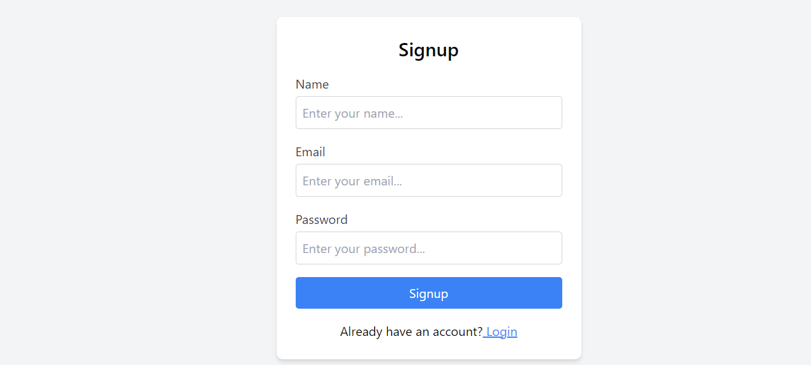

Project Features
User Authentication

JWT Tokens for secure access
bcrypt for password hashing
Responsive UI

Attractive and user-friendly design
Core Functionalities

Login and Signup
Appointment Booking
Additional Pages

Home
About Us
Treatments
Contact Us
Middleware Implementation

Essential middlewares for handling authentication and requests

# Login and Signup

# Home

# Appointment Booking

# About Us

# Treatments

# Contact Us

